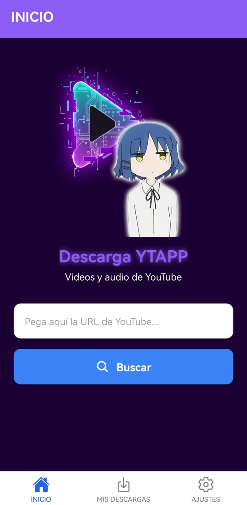
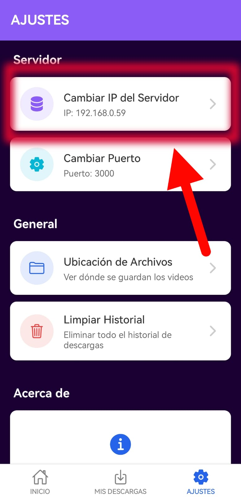
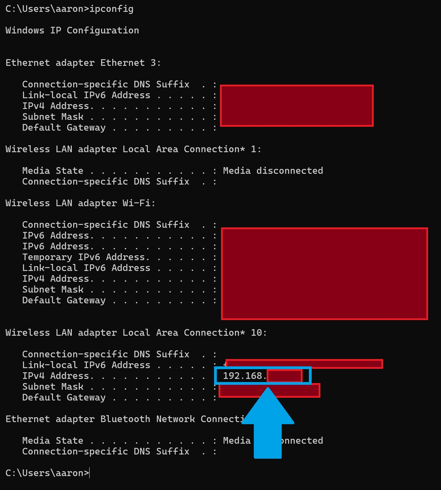
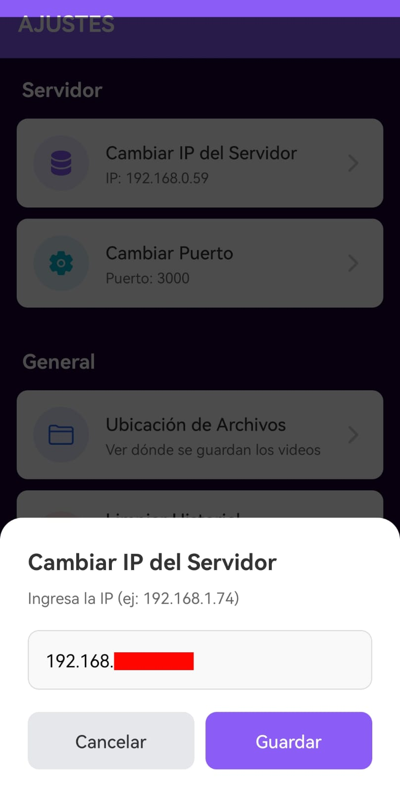
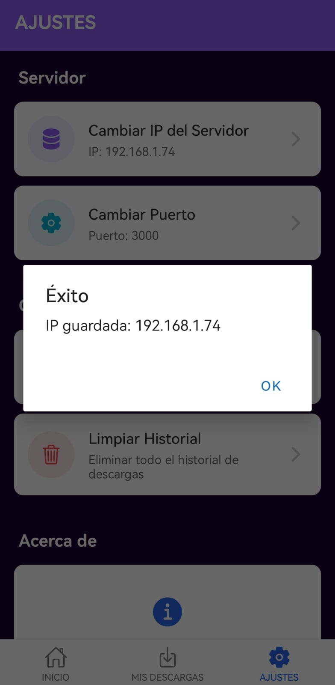
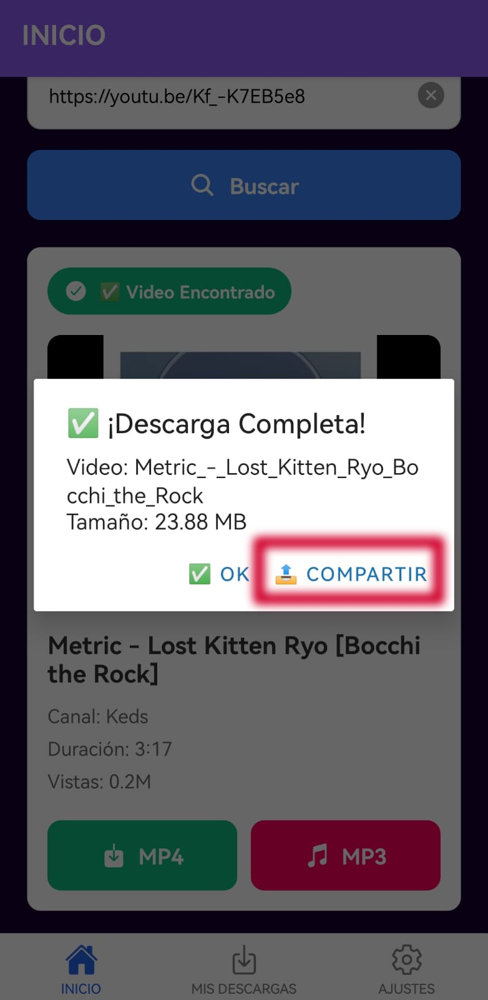
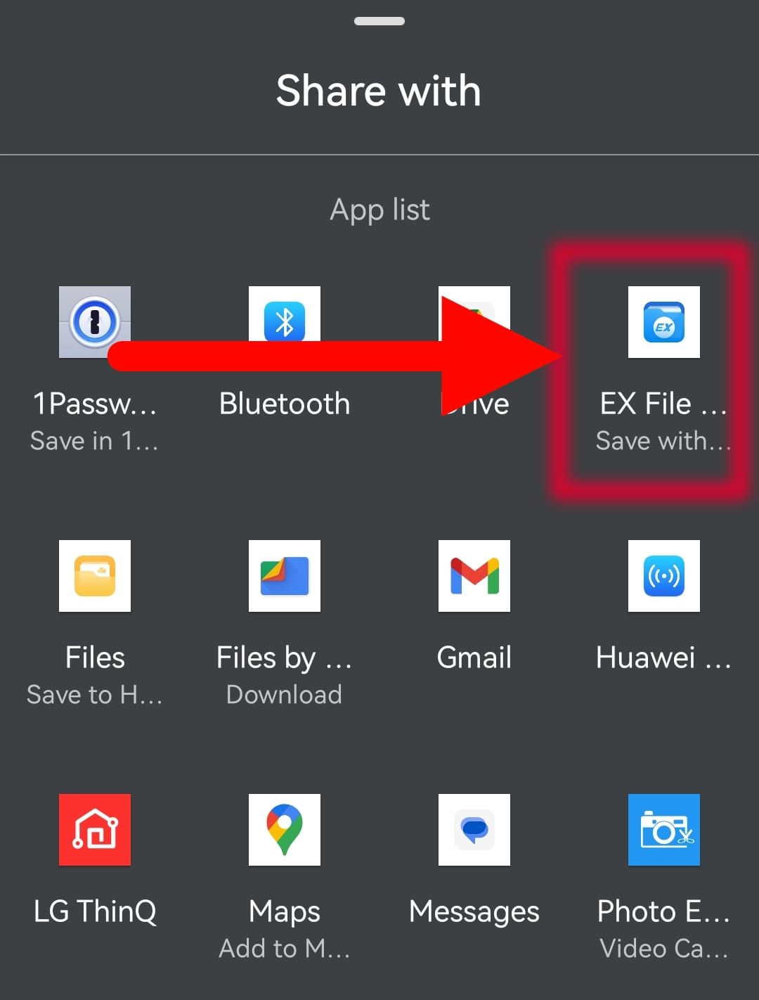
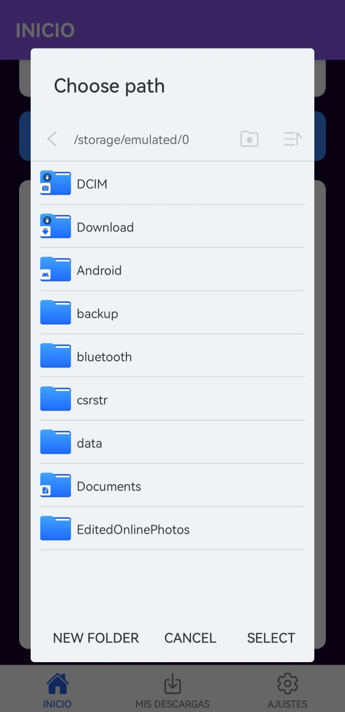
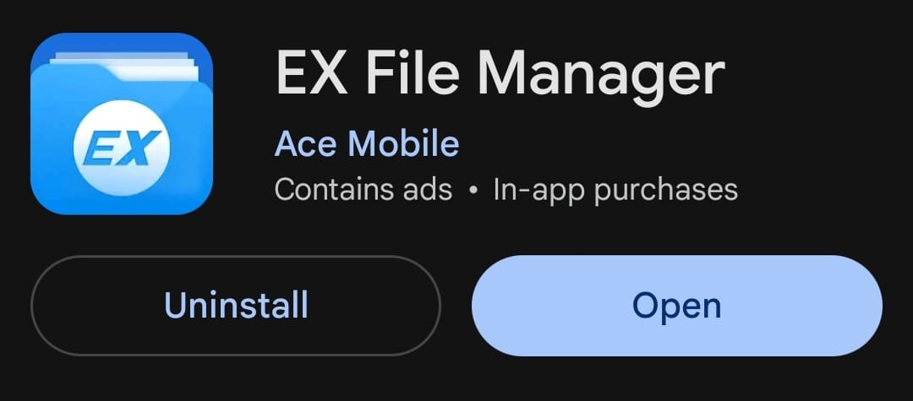
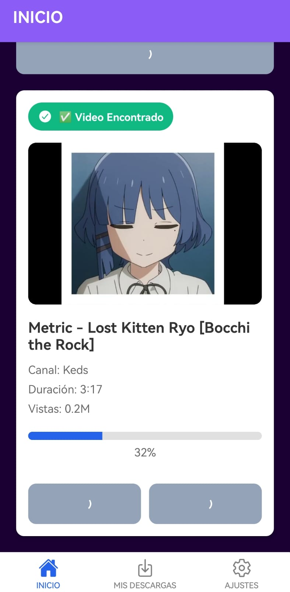

# DescargaYTAPP - Aplicación de Descarga de Videos de YouTube

## 1. Identificación del Proyecto

- **Nombre de la App:** DescargaYTAPP
- **Asignatura/Profesor:** Pentesting de Sistemas Operativos y Aplicaciones Web / M.C. Leonel González Vidales
- **Grupo:** 7A6
- **Periodo/Fecha:** Noviembre 2025
- **URL del Repositorio:** https://github.com/AaronVR1/DescargaYTAPP_

## 2. Descripción del Proyecto

DescargaYT es una aplicación móvil full-stack desarrollada con React Native (Expo) y Node.js que permite descargar **videos** y **audio** de YouTube con progreso en tiempo real. La aplicación cuenta con una interfaz moderna, sistema de progreso mediante Server-Sent Events (SSE), y capacidad de descargar **playlists** completas con metadatos embebidos.

### Características Principales:
- 📥 **Descarga de Videos Individuales**: MP4 en alta calidad con miniaturas
- 🎵 **Descarga de Audio**: MP3 a 320kbps con portadas incrustadas y metadatos ID3v2.3
- 📋 **Descarga de Playlists**: Playlists completas comprimidas en ZIP
- ⏱️ **Progreso en Tiempo Real**: Visualización de descarga mediante SSE (Server-Sent Events)
- 🖼️ **Metadatos Completos**: Miniaturas y metadatos (título, artista) embebidos automáticamente
- 📊 **Historial de Descargas**: Gestión completa de videos y playlists descargados
- 🎨 **Interfaz Moderna**: Diseño con tema oscuro morado y navegación intuitiva
- 📤 **Compartir Archivos**: Integración con Ex File Manager para gestión de archivos ZIP

### Funcionalidades Implementadas:
- Sistema de progreso en tiempo real con SSE
- Descarga individual de videos (MP4) y audio (MP3)
- Descarga de playlists con contador de videos (ej: "Video 5/35")
- Incrustación automática de thumbnails en archivos MP3
- Historial persistente con AsyncStorage
- Gestión de archivos temporales con limpieza automática (2 horas)
- Sin timeout: hasta 2 horas de descarga continua
- Configuración dinámica de IP del servidor
- Diseño responsivo optimizado para Android

## 3. Tecnologías y Versiones Utilizadas

### Stack Tecnológico:

#### Frontend (Cliente - React Native):
- **React Native:** 0.81.4
- **React:** 19.1.0
- **Expo:** ~54.0.3
- **React Navigation:** v7
- **AsyncStorage:** Para almacenamiento local
- **Expo FileSystem:** Para gestión de archivos
- **Expo Sharing:** Para compartir archivos
- **rn-eventsource:** Para Server-Sent Events (SSE)

#### Backend (Servidor - Node.js):
- **Node.js:** v18+
- **Express:** v4.18.2
- **yt-dlp:** Descarga de videos de YouTube
- **FFmpeg:** Conversión y procesamiento de audio/video
- **Archiver:** v7.0.1 - Compresión de playlists en ZIP
- **CORS:** v2.8.5 - Soporte para peticiones cross-origin

### Herramientas de Desarrollo Requeridas:

#### Para el Cliente:
- **Node.js:** v18.17.0 o superior
  ```bash
  node --version
  ```
- **NPM:** 9.0.0+ o Yarn v1.22.19+
  ```bash
  npm --version
  ```
- **Expo CLI:** v6.3.0+
  ```bash
  npx expo --version
  ```
- **Android Studio** con Android SDK 33+ **o** Expo Go app en dispositivo físico
  ```bash
  adb --version
  ```

#### Para el Servidor:
- **Node.js:** v18+
- **yt-dlp.exe:** Colocado en `servidor/bin/`
  ```bash
  # Verificar instalación
  ./servidor/bin/yt-dlp.exe --version
  ```
- **FFmpeg:** Colocado en `servidor/bin/`
  ```bash
  # Verificar instalación
  ./servidor/bin/ffmpeg.exe -version
  ```

### Verificación de Entorno:
```bash
# Cliente
npx expo doctor

# Servidor
node --version
npm --version
```

## 4. Estructura del Proyecto

### Organización de Archivos:
```
DescargaYTAPP/
├── cliente/                        # Aplicación React Native (Expo)
│   ├── App.js                      # Componente principal
│   ├── app.json                    # Configuración de Expo
│   ├── eas.json                    # Configuración de compilación
│   ├── package.json                # Dependencias del cliente
│   ├── assets/                     # Recursos estáticos
│   │   ├── adaptive-icon.png       # Ícono adaptable Android (1024x1024)
│   │   ├── favicon.png             # Ícono web (48x48)
│   │   ├── icon.png                # Ícono principal (1024x1024)
│   │   ├── splash-icon.png         # Splash screen (1284x2778)
│   │   └── images/
│   │       └── monachina.png       # Logo adicional
│   └── src/
│       ├── navigation/             # Configuración de navegación
│       │   └── AppNavigator.js     # Stack Navigator
│       ├── screens/                # Pantallas de la aplicación
│       │   ├── HomeScreen.js       # Pantalla principal de descarga
│       │   ├── DownloadsScreen.js  # Historial de descargas
│       │   └── SettingsScreen.js   # Configuración de IP
│       └── utils/                  # Utilidades y helpers
│           ├── config.js           # Gestión de configuración del servidor
│           └── storage.js          # Persistencia con AsyncStorage
│
└── servidor/                       # API Node.js + Express
    ├── server.js                   # Servidor principal
    ├── package.json                # Dependencias del servidor
    ├── bin/                        # Binarios
    │   ├── yt-dlp.exe             # Descargador de YouTube
    │   └── ffmpeg.exe             # Procesador multimedia
    ├── temp/                       # Archivos temporales (auto-limpieza)
    └── src/
        ├── routes/                 # Rutas de la API
        │   └── youtubeRoutes.js   # Endpoints de YouTube
        └── controllers/            # Lógica de negocio
            ├── youtubeController.js    # Videos individuales
            └── playlistController.js   # Playlists con SSE
```

### Arquitectura de la Aplicación:

#### Cliente (React Native):
- **HomeScreen.js**: Pantalla principal con input de URL y opciones de descarga
- **DownloadsScreen.js**: Historial con diseño diferenciado para videos/playlists
- **SettingsScreen.js**: Configuración de IP y puerto del servidor
- **config.js**: Gestión de URL del servidor con AsyncStorage
- **storage.js**: Persistencia del historial de descargas

#### Servidor (Node.js):
- **server.js**: Configuración de Express con timeout de 2 horas
- **youtubeRoutes.js**: Definición de endpoints (videos, playlists, SSE)
- **youtubeController.js**: Lógica de descarga individual
- **playlistController.js**: Lógica de descarga de playlists con SSE

## 5. Instalación y Configuración

### 5.1 Instalación del Servidor

```bash
# Navegar a la carpeta del servidor
cd servidor

# Instalar dependencias
npm install

# Verificar que yt-dlp y ffmpeg estén en bin/
ls bin/
# Debe mostrar: yt-dlp.exe, ffmpeg.exe
```

#### Dependencias del Servidor:

| Dependencia | Versión | Propósito |
|-------------|---------|-----------|
| `express` | ^4.18.2 | Framework web para crear la API REST |
| `cors` | ^2.8.5 | Permitir peticiones desde el cliente móvil |
| `archiver` | ^7.0.1 | Comprimir playlists en formato ZIP |
| `dotenv` | ^16.3.1 | Gestión de variables de entorno |

#### Iniciar el Servidor:

```bash
npm start
```

**Salida esperada:**
```
========== CONFIGURACIÓN INICIAL ==========
🎵 yt-dlp en: C:\...\servidor\bin\yt-dlp.exe
Existe: ✅
📁 Temp en: C:\...\servidor\temp
🎬 FFmpeg en: C:\...\servidor\bin\ffmpeg.exe
Existe: ✅
==========================================
🚀 Servidor corriendo en http://localhost:3000
📡 Accesible desde: http://192.168.0.59:3000
✅ Presiona Ctrl+C para detener
```

**Nota importante:** Copia la IP mostrada (ej: `192.168.0.59`) para configurarla en la app móvil.

### 5.2 Instalación del Cliente

```bash
# Navegar a la carpeta del cliente
cd cliente

# Instalar dependencias
npm install

# Instalar rn-eventsource (para SSE)
npm install rn-eventsource
```

#### Dependencias del Cliente:

| Dependencia | Versión | Propósito |
|-------------|---------|-----------|
| `@react-navigation/native` | ^7.x | Core de navegación entre pantallas |
| `@react-navigation/bottom-tabs` | ^7.x | Navegación por pestañas |
| `@react-native-async-storage/async-storage` | ^2.x | Almacenamiento local persistente |
| `expo-file-system` | ~18.x | Gestión de archivos y descargas |
| `expo-sharing` | ~13.x | Compartir archivos con otras apps |
| `rn-eventsource` | ^2.x | Server-Sent Events para progreso en tiempo real |
| `@expo/vector-icons` | ^14.x | Íconos de Ionicons |

#### Iniciar el Cliente:

```bash
npm start
```

Se abrirá Expo Dev Tools en el navegador. Opciones:
- Escanear QR con Expo Go (Android/iOS)
- Presionar `a` para abrir en emulador Android
- Presionar `i` para abrir en simulador iOS (solo macOS)

### Verificar Instalación:

```bash
# Cliente
cd cliente
npm list --depth=0

# Servidor
cd servidor
npm list --depth=0
```

## 6. Configuración Inicial de la App

### PASO 1: Configurar IP del Servidor ⚙️

**IMPORTANTE:** Antes de descargar cualquier video, debes configurar la IP del servidor.

1. **Abrir la app** en tu dispositivo Android

2. **Ir a la pestaña "Configuración"** (ícono de engranaje)

3. **Verificar la IP actual** Utilizamos ipconfig en CMD para verla

4. **Si es incorrecta:**
   - Toca el campo "Dirección IP"
   - Ingresa la IP que apareció al iniciar el servidor (ej: `192.168.0.59`)
   - Toca "Guardar Configuración"

5. **Verificar conexión:**
   - Debe aparecer: "✅ Configuración guardada exitosamente"


**Nota:** El servidor y tu teléfono deben estar en la **misma red WiFi**.

### PASO 2: Verificar Conexión y descargar videos

Una vez configurada la IP:
1. Ve a la pestaña "Inicio"
2. Pega cualquier URL de YouTube
3. Si se carga la información del video, la conexión es correcta

*Comprobacion de Conexion al momento de pegar url:

*Elegir un formato de Descarga

*Una vez descargado se eleccionara la aplicacion: Ex File Explorer

Elegiremos la ruta donde se descargara nuestro video

Verificamos que ya este en la galeria


## 7. Ejecución de la Aplicación

### Scripts Disponibles:

#### Cliente:
```bash
# Iniciar servidor de desarrollo
npm start

# Ejecutar en Android
npm run android

# Ejecutar en iOS (solo macOS)
npm run ios

# Limpiar caché
npx expo start --clear
```

#### Servidor:
```bash
# Iniciar servidor
npm start

# Modo desarrollo con nodemon (auto-reinicio)
npm run dev
```

### Primera Ejecución Completa:

#### Terminal 1 - Servidor:
```bash
cd servidor
npm install
npm start
```
**Esperar mensaje:** `🚀 Servidor corriendo en http://...`

#### Terminal 2 - Cliente:
```bash
cd cliente
npm install
npm start
```
**Escanear QR** con Expo Go o presionar `a` para Android.

### Notas de Entorno:
- **Puerto del servidor:** 3000 (modificable en `servidor/server.js`)
- **Misma red WiFi:** Obligatorio para comunicación cliente-servidor
- **Emulador Android:** Debe estar iniciado antes de `npm run android`
- **Dispositivo físico:** Usar Expo Go y escanear QR

## 8. Funcionalidades de la Aplicación

### 8.1 Pantalla Principal (HomeScreen)

#### Características:
- **Input de URL**: Campo para pegar URLs de YouTube (videos o playlists)
- **Detección Automática**: Identifica si es video individual o playlist
- **Vista Previa**: Muestra miniatura, título, duración y canal
- **Opciones de Descarga**:
  - 🎵 **MP3** - Audio a 320kbps con portada incrustada
  - 🎬 **MP4** - Video en mejor calidad disponible
- **Indicador de Progreso**: Barra de progreso y contador en tiempo real

#### Flujo de Uso - Video Individual:
1. Pegar URL de YouTube en el campo de texto
2. Esperar a que cargue la información del video
3. Verificar miniatura y título
4. Seleccionar formato (MP3 o MP4)
5. Observar progreso de descarga
6. Al finalizar, archivo guardado en el historial

#### Flujo de Uso - Playlist:
1. Pegar URL de playlist de YouTube
2. Esperar a que cargue: "📋 Playlist encontrada: [Nombre] - 35 videos"
3. Seleccionar formato (MP3 o MP4)
4. **Observar progreso detallado**:
   ```
   📋 Obteniendo lista de videos... 5%
   📹 Encontrados 35 videos 10%
   🎵 Descargando: Video 1 15%
   🎵 Descargando: Video 2 20%
   ...
   📦 Comprimiendo archivos... 85%
   ✅ ¡Descarga completa! 100%
   ```
5. Al finalizar, se descarga un archivo ZIP
6. Opciones: **OK** o **Compartir ZIP**


### 8.2 Pantalla de Descargas (DownloadsScreen)

#### Características:
- **Historial Completo**: Videos individuales y playlists
- **Diseño Diferenciado**:
  - Videos: Miniatura del video
  - Playlists: Ícono de playlist morado con contador
- **Información Detallada**:
  - Título
  - Tamaño del archivo
  - Fecha y hora de descarga
- **Acciones Disponibles**:
  - 📤 **Compartir**: Enviar a Ex File Manager u otras apps
  - 🗑️ **Eliminar**: Borrar archivo y quitar del historial

#### Ejemplo de Playlist en Historial:
```
┌─────────────────────────────────┐
│  [ÍCONO PLAYLIST MORADO]        │
│       PLAYLIST                  │
├─────────────────────────────────┤
│  [35 videos • MP3]              │
│  🎵 Playlist: Prueba            │
│  📦 335.98 MB                   │
│  27 de noviembre de 2024, 11:30│
│  [📤 Compartir] [🗑️ Eliminar]  │
└─────────────────────────────────┘
```

### 8.3 Pantalla de Configuración (SettingsScreen)

#### Opciones de Configuración:
- **Dirección IP del Servidor**:
  - Campo editable con IP actual
  - Botón "Guardar Configuración"
  - Validación de formato IP
- **Puerto del Servidor**: 3000 (fijo)
- **Versión de la App**: Mostrada en la parte inferior

#### Cambiar Servidor:
1. Abrir "Configuración"
2. Tocar campo "Dirección IP"
3. Ingresar nueva IP (ej: `192.168.1.100`)
4. Presionar "Guardar Configuración"
5. Verificar: "✅ Configuración guardada"

### 8.4 Compartir Archivos con Ex File Manager

#### ¿Por qué Ex File Manager?

- ✅ Apertura de archivos ZIP
- ✅ Extracción de contenido
- ✅ Gestión avanzada de archivos
- ✅ Compartir a múltiples destinos (Drive, WhatsApp, etc.)


#### Flujo Completo:

1. **Descargar playlist** (genera archivo ZIP)
2. **En el historial**, presionar "📤 Compartir"
3. **Seleccionar "Ex File Manager"** de la lista de apps
4. **En Ex File Manager**:
   - El archivo ZIP aparece automáticamente
   - Opción 1: Tocar ZIP → "Extraer" → Elegir carpeta
   - Opción 2: Tocar ZIP → "Compartir" → Drive/WhatsApp/etc.

!
#### Instalación de Ex File Manager:
```
Play Store → Buscar "Ex File Manager" → Instalar
O descargar APK 
```


### 8.5 Características Técnicas Implementadas

#### Progreso en Tiempo Real (SSE):
- Conexión persistente con el servidor
- Eventos enviados por cada video descargado
- Actualización de UI sin polling
- Manejo de reconexión automática



#### Gestión de Metadatos:
- **Para MP3**:
  1. Descarga audio con yt-dlp
  2. Descarga thumbnail del video
  3. Extrae metadatos (título, canal)
  4. Incrusta thumbnail con FFmpeg
  5. Añade metadatos ID3v2.3
  6. Resultado: MP3 con portada visible en reproductores

#### Manejo de Playlists:
- Descarga video por video (no todos a la vez)
- Compresión en ZIP al finalizar
- Limpieza automática de archivos temporales
- JobID único para cada descarga
- Timeout de 2 horas por descarga

## 9. Endpoints de la API

### Videos Individuales:

| Método | Endpoint | Descripción | Respuesta |
|--------|----------|-------------|-----------|
| GET | `/api/youtube/info?url=<URL>` | Obtener información del video | JSON con título, duración, thumbnail |
| GET | `/api/youtube/download?url=<URL>` | Descargar video MP4 | Archivo MP4 |
| GET | `/api/youtube/audio?url=<URL>` | Descargar audio MP3 | Archivo MP3 con portada |

### Playlists:

| Método | Endpoint | Descripción | Respuesta |
|--------|----------|-------------|-----------|
| GET | `/api/youtube/playlist/info?url=<URL>` | Info de la playlist | JSON con título, cantidad de videos |
| GET | `/api/youtube/playlist/audio/progress?url=<URL>` | Descargar playlist MP3 (SSE) | Stream SSE con progreso |
| GET | `/api/youtube/playlist/video/progress?url=<URL>` | Descargar playlist MP4 (SSE) | Stream SSE con progreso |
| GET | `/api/youtube/playlist/download/:jobId` | Descargar ZIP generado | Archivo ZIP |

### Ejemplo de Eventos SSE:

```
event: status
data: {"message":"🎵 Descargando: Video 1","progress":15,"current":1,"total":35}

event: status
data: {"message":"🎵 Descargando: Video 2","progress":20,"current":2,"total":35}

event: complete
data: {"jobId":"audio_PLxxx_123456789","message":"✅ Descarga completa"}
```

## 10. Desarrollo y Extensión

### Próximas Funcionalidades Sugeridas:
- **Selector de Calidad**: Elegir resolución de video (720p, 1080p, 4K)
- **Descarga en Background**: Continuar descarga al minimizar la app
- **Notificaciones Push**: Alertar cuando termine una descarga larga
- **Múltiples Descargas**: Cola de descargas simultáneas
- **Integración con Spotify**: Descargar playlists de Spotify
- **Modo Offline**: Caché de videos para reproducción offline
- **Estadísticas**: Gráficas de descargas por mes/tipo

### Estructura para Nuevas Pantallas:

```javascript
// src/screens/NewScreen.js
import React from 'react';
import { View, Text, StyleSheet } from 'react-native';

export default function NewScreen() {
  return (
    <View style={styles.container}>
      <Text style={styles.title}>Nueva Pantalla</Text>
    </View>
  );
}

const styles = StyleSheet.create({
  container: {
    flex: 1,
    backgroundColor: '#1a0033',
    padding: 20,
  },
  title: {
    color: '#fff',
    fontSize: 24,
    fontWeight: 'bold',
  },
});
```

### Agregar Nuevos Endpoints:

```javascript
// servidor/src/routes/youtubeRoutes.js
router.get('/new-endpoint', async (req, res) => {
  try {
    // Lógica del endpoint
    res.json({ success: true });
  } catch (error) {
    res.status(500).json({ error: error.message });
  }
});
```

## 11. Troubleshooting

### Problemas Comunes:

| Problema | Solución |
|----------|----------|
| **"Network request failed"** | Verificar que servidor esté corriendo y en la misma red WiFi |
| **"EventSource doesn't exist"** | `npm install rn-eventsource` |
| **Timeout después de 2 minutos** | Verificar que `server.js` tenga configurado timeout de 2 horas |
| **Playlists no aparecen en historial** | Actualizar `HomeScreen.js` y `DownloadsScreen.js` |
| **MP3 sin portada** | Verificar que FFmpeg esté en `servidor/bin/` |
| **"Cannot read property 'unzip'"** | Cambiar a compartir ZIP directamente (no extraer automáticamente) |
| **Ex File Manager no aparece** | Verificar que esté instalado en el dispositivo |

### Comandos Útiles:

```bash
# Cliente - Limpiar caché
npx expo start --clear

# Cliente - Reinstalar dependencias
rm -rf node_modules package-lock.json && npm install

# Servidor - Reiniciar
Ctrl+C
npm start

# Verificar conexión del servidor
curl http://192.168.0.59:3000

# Ver logs del servidor
# Los logs aparecen en la consola donde ejecutas npm start
```

### Errores Específicos:

#### Error: "yt-dlp no encontrado"
```bash
# Descargar yt-dlp.exe
# Windows: https://github.com/yt-dlp/yt-dlp/releases
# Colocar en: servidor/bin/yt-dlp.exe
```

#### Error: "FFmpeg no encontrado"
```bash
# Descargar FFmpeg
# Windows: https://ffmpeg.org/download.html
# Colocar en: servidor/bin/ffmpeg.exe
```

#### Error: "Cannot find module 'rn-eventsource'"
```bash
cd cliente
npm install rn-eventsource
```

## 12. Compilación del APK

### Usando EAS Build:

```bash
# Instalar EAS CLI
npm install -g eas-cli

# Login en Expo
eas login

# Configurar proyecto (solo primera vez)
cd cliente
eas build:configure

# Compilar APK
eas build --platform android --profile preview
```

### Resultado:
- Tiempo de compilación: 10-15 minutos
- Link de descarga del APK aparecerá en la terminal
- También disponible en: https://expo.dev/accounts/[usuario]/builds

### Instalar APK:
1. Descargar APK desde el link
2. Transferir a dispositivo Android
3. Habilitar "Fuentes desconocidas" en Ajustes
4. Instalar APK
5. Abrir app

## 13. Recursos y Documentación

### Documentación Oficial:
- [Expo Documentation](https://docs.expo.dev/)
- [React Native Docs](https://reactnative.dev/)
- [React Navigation](https://reactnavigation.org/)
- [yt-dlp Documentation](https://github.com/yt-dlp/yt-dlp)
- [FFmpeg Documentation](https://ffmpeg.org/documentation.html)
- [Express.js Guide](https://expressjs.com/)

### Herramientas Externas:
- **Ex File Manager**: Gestor de archivos para Android
- **Expo Go**: App para desarrollo y testing
- **Postman**: Testing de endpoints de la API

## 14. Licencia y Disclaimer

### ⚠️ Aviso Legal Importante


### Propósito Educativo:
Este proyecto fue desarrollado como parte del curso de **Pentesting de Sistemas Operativos y Aplicaciones Web** con los siguientes objetivos académicos:
- Aprender desarrollo full-stack móvil
- Implementar comunicación cliente-servidor
- Trabajar con Server-Sent Events (SSE)
- Gestionar archivos y metadatos multimedia
- Aplicar buenas prácticas de desarrollo

### Responsabilidad:
El autor y desarrolladores **NO** se hacen responsables del mal uso de esta aplicación. Cualquier uso indebido es responsabilidad exclusiva del usuario final.

### Licencia:
Este proyecto está bajo licencia educativa y no puede ser redistribuido con fines comerciales.

---

## 15. Créditos y Agradecimientos

### Desarrollado por:
**Aaron Vega**
- Grupo: 7A6
- Asignatura: Pentesting de Sistemas Operativos y Aplicaciones Web
- Institución: Instituto Tecnologico de Ciudad Altamirano
### Profesor:
**M.C. Leonel González Vidales**

### Tecnologías de Terceros:
- **yt-dlp**: Herramienta de descarga de videos
- **FFmpeg**: Procesamiento multimedia
- **Expo**: Framework de desarrollo móvil
- **React Native**: Framework de UI móvil
- **Node.js**: Runtime de JavaScript
- **Express**: Framework web

---

## 16. Changelog

### Versión 1.0.0 (Noviembre 2025)
- ✅ Lanzamiento inicial
- ✅ Descarga de videos individuales (MP3/MP4)
- ✅ Descarga de playlists completas
- ✅ Sistema de progreso en tiempo real (SSE)
- ✅ Incrustación de thumbnails en MP3
- ✅ Metadatos ID3v2.3 completos
- ✅ Historial de descargas persistente
- ✅ Configuración dinámica de IP
- ✅ Integración con Ex File Manager
- ✅ Diseño moderno con tema oscuro
- ✅ Timeout extendido (2 horas)
- ✅ Gestión de errores robusta

---

**Desarrollado por:** Aaron Vega
**Última actualización:** 27 de noviembre de 2025  
**Versión:** 1.0.0  
**Estado del Proyecto:** ✅ Completo y funcional