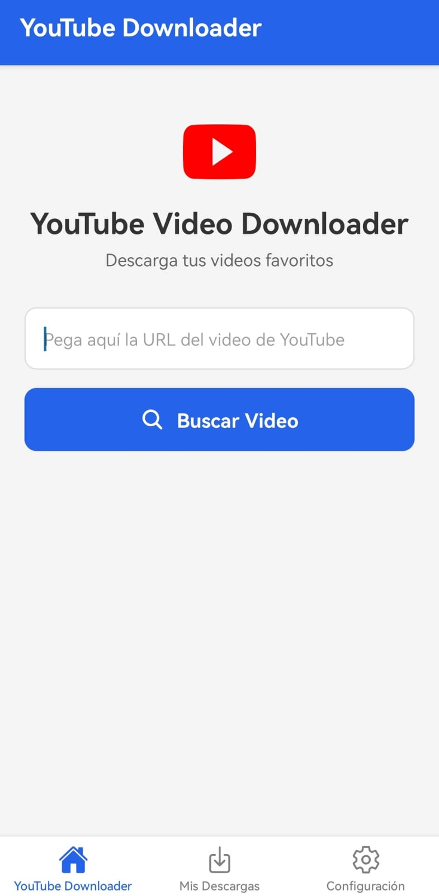
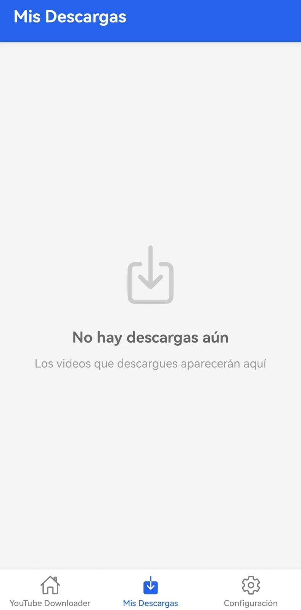
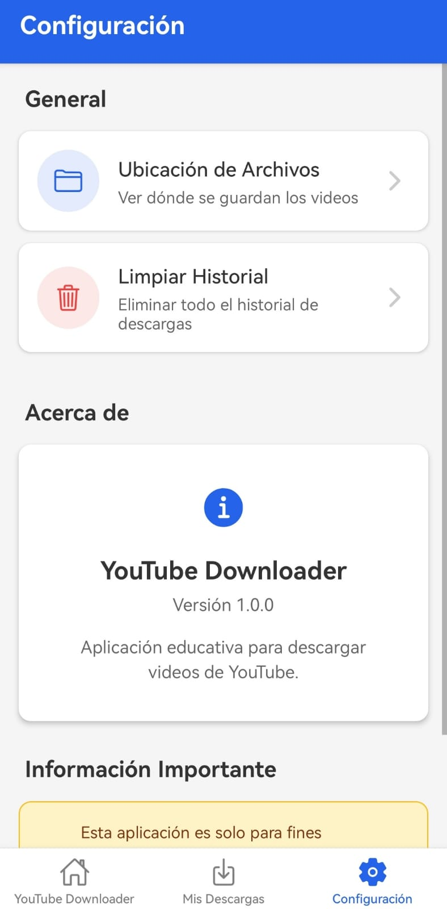

# 📱 DescargaYTAPP
## 📋 Tabla de Contenidos

- [Características](#-características)
- [Capturas de Pantalla](#-capturas-de-pantalla)
- [Tecnologías](#-tecnologías)
- [Requisitos Previos](#-requisitos-previos)
- [Instalación](#-instalación)
- [Configuración](#-configuración)
- [Uso](#-uso)
- [Estructura del Proyecto](#-estructura-del-proyecto)
- [API](#-api)
- [Solución de Problemas](#-solución-de-problemas)
- [Contribuciones](#-contribuciones)
- [Licencia](#-licencia)
- [Contacto](#-contacto)

## ✨ Características

- 🔍 **Búsqueda de Videos**: Ingresa la URL de cualquier video de YouTube
- 📊 **Información Detallada**: Visualiza título, miniatura, canal, duración y más
- 📥 **Gestión de Descargas**: Sistema de historial para videos guardados
- 🎨 **Interfaz Moderna**: Diseño intuitivo con Gluestack UI y NativeWind
- 📱 **Navegación por Tabs**: Tres pantallas principales (Home, Descargas, Configuración)
- 🌐 **Compartir Videos**: Funcionalidad para compartir videos con otras apps
- ⚙️ **Configuración**: Gestión de almacenamiento y preferencias
## Screenshots




```

## 🛠 Tecnologías

### Frontend
- **React Native:** 0.81.4
- **React:** 19.1.0
- **Expo:** ~54.0.12
- **React Navigation:** 7.1.17
  - Native Stack: 7.3.26
  - Bottom Tabs: 7.4.7
- **React Native Screens:** ~4.16.0
- **React Native Safe Area Context:** ~5.6.0

### UI/UX
- **Gluestack UI:** ^3.0.0
- **NativeWind:** ^4.1.23
- **Tailwind CSS:** ^3.4.17
- **React Native SVG:** 15.12.1
- **Expo Vector Icons:** ^15.0.2

### Utilidades
- **Axios:** ^1.12.2
- **Expo File System:** ~19.0.16
- **Expo Sharing:** ~14.0.7
- **AsyncStorage:** ^2.2.0
- **React Native Progress:** ^5.0.1

### Animaciones
- **React Native Reanimated:** 4.1.2
- **React Native Worklets:** 0.6.0

## 📋 Requisitos Previos

Antes de comenzar, asegúrate de tener instalado:

- **Node.js** (v18 o superior)
- **npm** o **yarn**
- **Expo Go** (en tu dispositivo móvil)
- **Git**
- Cuenta en [RapidAPI](https://rapidapi.com/) (para la API key)

## 🚀 Instalación

### 1. Clonar el repositorio

```bash
git clone https://github.com/AaronVR1/DescargaYTAPP
cd youtube-downloader-app/client
```

### 2. Instalar dependencias

```bash
# Usando yarn (recomendado)
yarn install

# O usando npm
npm install
```

### 3. Instalar dependencias de Expo

```bash
npx expo install
```

## ⚙️ Configuración

### 1. Obtener API Key de RapidAPI

1. Ve a [RapidAPI](https://rapidapi.com/)
2. Regístrate o inicia sesión
3. Busca "YouTube Media Downloader"
4. Suscríbete al plan gratuito
5. Copia tu API Key

### 2. Configurar variables de entorno

Crea un archivo `.env` en la raíz del proyecto:

```env
RAPID_API_KEY=tu_api_key_aqui
RAPID_API_HOST=youtube-media-downloader.p.rapidapi.com
```

### 3. Configurar Babel

Asegúrate de que tu `babel.config.js` tenga esta configuración:

```javascript
module.exports = function(api) {
  api.cache(true);
  return {
    presets: [["babel-preset-expo", {
      jsxImportSource: "nativewind"
    }], "nativewind/babel"],
    plugins: [
      ["module-resolver", {
        root: ["./"],
        alias: {
          "@": "./",
          "tailwind.config": "./tailwind.config.js"
        }
      }],
      "react-native-reanimated/plugin"
    ]
  };
};
```

## 🎯 Uso

### Iniciar el proyecto

```bash
# Iniciar servidor de desarrollo
npx expo start

# Iniciar con caché limpio
npx expo start -c

# Iniciar en modo tunnel (para conexiones más estables)
npx expo start --tunnel
```

### Ejecutar en dispositivo

1. **En tu teléfono móvil:**
   - Descarga **Expo Go** desde Play Store (Android) o App Store (iOS)
   - Escanea el código QR que aparece en la terminal

2. **En navegador web:**
   - Presiona `w` en la terminal

3. **En emulador Android:**
   - Presiona `a` en la terminal (requiere Android Studio)

### Usar la aplicación

1. **Pantalla Principal (Home):**
   - Pega una URL de YouTube en el campo de texto
   - Presiona "Buscar Video"
   - Visualiza la información del video
   - Presiona "Descargar Video" (actualmente abre en YouTube)

2. **Pantalla de Descargas:**
   - Visualiza el historial de videos guardados
   - Comparte videos con otras apps
   - Elimina videos del historial

3. **Pantalla de Configuración:**
   - Revisa la ubicación de archivos
   - Limpia el historial completo
   - Lee información sobre la app

## 📁 Estructura del Proyecto

```
client/
├── src/
│   ├── api/
│   │   └── youtubeApi.js          # Configuración de API y peticiones
│   ├── screens/
│   │   ├── HomeScreen.js          # Pantalla principal
│   │   ├── DownloadsScreen.js     # Historial de descargas
│   │   └── SettingsScreen.js      # Configuración
│   ├── navigation/
│   │   └── AppNavigator.js        # Navegación con tabs
│   └── utils/
│       └── storage.js             # AsyncStorage functions
├── components/
│   └── ui/                        # Componentes de Gluestack UI
├── App.js                         # Punto de entrada
├── babel.config.js                # Configuración de Babel
├── metro.config.js                # Configuración de Metro
├── tailwind.config.js             # Configuración de Tailwind
├── global.css                     # Estilos globales
├── package.json                   # Dependencias
└── .env                           # Variables de entorno
```

## 🔌 API

### Endpoints Utilizados

La aplicación utiliza la API de YouTube Media Downloader de RapidAPI:

**Base URL:** `https://youtube-media-downloader.p.rapidapi.com`

#### 1. Obtener Información del Video

```javascript
GET /v2/video/details?videoId={VIDEO_ID}
```

**Respuesta:**
```json
{
  "title": "Título del video",
  "thumbnails": [{"url": "..."}],
  "channel": {"name": "Nombre del canal"},
  "lengthSeconds": 126,
  "viewCount": 4219,
  "likeCount": 113
}
```

### Funciones Principales

**src/api/youtubeApi.js:**

- `getVideoInfo(videoUrl)` - Obtiene información detallada del video
- `getDownloadLinks(videoUrl)` - Obtiene enlaces de descarga (en desarrollo)
- `extractVideoId(url)` - Extrae el ID del video de la URL
- `isValidYouTubeUrl(url)` - Valida si la URL es de YouTube

## 🐛 Solución de Problemas

### Error: "Cannot find module 'react-native-reanimated/plugin'"

```bash
yarn add react-native-reanimated
yarn add react-native-worklets
npx expo start -c
```

### Error: "Request failed with status code 403"

- Verifica que tu API Key sea válida
- Confirma que tu suscripción en RapidAPI esté activa
- Revisa los límites de tu plan gratuito

### Error: "Something went wrong"

```bash
# Limpia el caché completamente
rd /s /q .expo
rd /s /q node_modules
yarn install
npx expo start -c
```

### La app no carga en el teléfono

- Verifica que ambos dispositivos estén en la misma red WiFi
- Intenta usar modo tunnel: `npx expo start --tunnel`
- Desactiva temporalmente el firewall de Windows

### Advertencias de versiones de paquetes

```bash
npx expo install --fix
```

## 🤝 Contribuciones

Las contribuciones son bienvenidas. Para contribuir:

1. Fork el proyecto
2. Crea una rama para tu feature (`git checkout -b feature/AmazingFeature`)
3. Commit tus cambios (`git commit -m 'Add some AmazingFeature'`)
4. Push a la rama (`git push origin feature/AmazingFeature`)
5. Abre un Pull Request

## ⚠️ Notas Importantes

- **Uso Educativo:** Esta aplicación es solo para fines educativos
- **Derechos de Autor:** Respeta las políticas de YouTube y los derechos de autor
- **Limitaciones de la API:** El plan gratuito tiene límites de requests
- **Descarga Real:** Actualmente, la funcionalidad de descarga abre el video en YouTube debido a restricciones de la API

## 📄 Licencia

Este proyecto está bajo la Licencia MIT. Ver el archivo `LICENSE` para más detalles.

## 📧 Contacto

Tu Nombre - [@tu_twitter](https://twitter.com/tu_twitter) - tu_email@example.com

Link del Proyecto: [https://github.com/AaronVR1/DescargaYTAPP]

---
